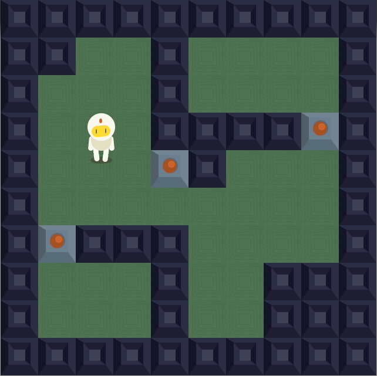

Asteroids
=========
Bomberman is a strategic, maze-based video game franchise originally developed by Hudson Soft. The general goal throughout the series is to complete the levels by strategically placing bombs in order to kill enemies and destroy obstacles. Exploding bombs can set off other bombs, kill or injure enemies, and destroy obstacles. However, they can also kill or injure the player character.

Dependecies
===========

* OpenGL
* OpenAL
* DevIL
* SDL2
* Alut
* xercesc
* libxsd

---
* On an **Unix based system**, you need to do your own house keeping and install these dependencies.
* On **Windows**, all the dependecies are included under the deps directory.

Building
===========
To build the game from the source you will need [cmake](http://www.cmake.org/). 

    cd Bomberman
    mkdir build
    cd build
    cmake ..
    make

Supported Platforms
===================

* Windows
* GNU/Linux

How the game looks
==================

Special thanks
==============

[Jacob Zinman-Jeanes](http://jeanes.co/) for creating these awesome sprites!
